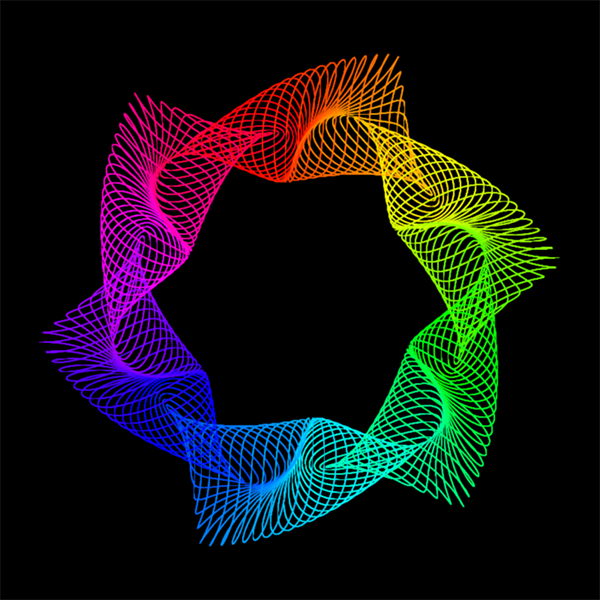

# Spirograph

A simple applet for creating geometric drawings.



Inspired by [this video](https://youtu.be/BG9e06IWAxE).

## Build

To create an executable JAR file, simply run

```sh
$ ant
```

from the project root.
